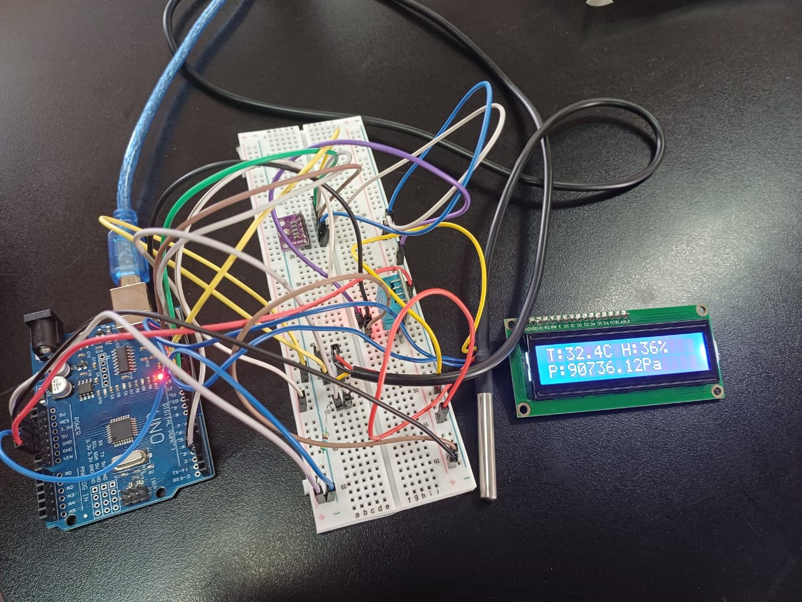

# Arduino-Based Digital Thermometer 🌡️

This project is a digital thermometer built using an Arduino and three key sensors:
- **BMP280** – Measures barometric pressure
- **DHT11** – Measures humidity
- **DS18B20** – Measures temperature (digital sensor)

The live readings are displayed on an **LCD screen**, providing a compact and portable thermometer system suitable for DIY or educational projects.

---

## 📦 Components Used

- Arduino Uno
- BMP280 Pressure Sensor
- DHT11 Humidity Sensor
- DS18B20 Digital Temperature Sensor
- 16x2 LCD Screen
- Breadboard & jumper wires

---

## 🛠️ Functionality

- Reads real-time values from all 3 sensors
- Displays temperature (DS18B20), humidity (DHT11), and pressure (BMP280) on LCD
- Code written in Arduino IDE

---

## 📸 Demonstration

### LCD Output

### 📹 Demo Video

[Click to view demo video](assets/demo_video.mp4)

---

## 📁 Code

The full Arduino sketch is available in the `code/` folder.

---

## 🔧 Getting Started

1. Install the required sensor libraries via Arduino IDE:
   - `Adafruit_BMP280`
   - `DHT sensor library`
   - `OneWire` and `DallasTemperature`

2. Upload `thermometer.ino` to your Arduino.

---

## 📜 License

MIT License © 2025 Your Name
